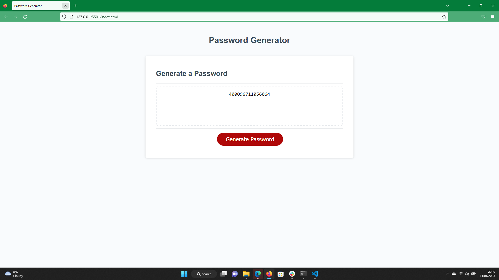

## Password Generator

## Description

I created the password generator in order to develop my skills and knowledge of javascript, particularly implementing functions and methods. In building this project I managed to
apply a number of javascript features whilst also working on my logical thinking and resilience to problems. The project also has a real-world use case, solving the problem of secure 
password creating whenever needed. On completion of the project build I feel I now have a more in depth understanding of javascript functions, methods, arrays, variable scope and syntax.

## Installation

N/A.

## Usage

Simply click the button and follow the prompts accurately to create your password.

## Credits

N/A.

## License

please see license file in main branch of gitHub repository.

## Deployed Site

https://jamesrobertsutcliffe.github.io/password-generator/
